# 基于强化学习的智能小车跟随与自适应超车系统
# Learning to Follow and Overtake: An RL Approach to the Car-Following Problem

**作者**：（你的名字）　**日期**：2026 年 9 月

---

## 摘要

2022 年 TI 杯电子设计竞赛 C 题要求设计双小车跟随行驶系统，其控制器依赖手工
规则，对场景变化脆弱。本文将该赛题重构为强化学习问题，在自建的二维数字孪生
环境中，以 PPO 算法训练跟随车的间距控制与换道超车决策，并与手工规则方法进行
严格对照实验（同观测、同接口、同随机种子）。本文提出"**动作先验 + 残差学习 +
车辆动力学约束**"的分层架构：零动作即与领头车速度同步，安全由结构保证而非
奖励赌注；针对超车任务中"跟随"局部最优构成的深度探索峡谷，采用行为克隆热身
（LfD）+ PPO 微调的管线跨越。实验表明：跟车任务的稳态间距误差从最优规则方法的
1.93 cm 降至 1.00 cm（执行器域随机化下 1.06 cm），碰撞为零；换道超车任务在零
失误前提下将平均超车耗时从手工状态机的 2.0 s 压缩至 1.4 s（提升 30%），且在
域随机化下性能完全不退化。本文完整记录了 14 轮"失败—诊断—修复"的迭代过程，
并开源全部代码、模型与复现指南，可作为强化学习入门与工程实践的参考案例。

**关键词**：强化学习；PPO；行为克隆；数字孪生；小车跟随；换道超车；奖励整形

## Abstract

The car-following problem from the 2022 TI Cup Electronic Design Contest is
reformulated as a reinforcement learning task. In a self-built 2D digital-twin
simulator, we train a follower's spacing control and overtaking decisions with
Proximal Policy Optimization (PPO), and compare against hand-crafted rules under
identical observations, interfaces, and random seeds. A layered architecture of
**action prior + residual learning + vehicle dynamics constraints** guarantees
safety structurally: a zero action already matches the leader's speed. To escape
the deep exploration valley posed by the "follow forever" local optimum in the
overtaking task, a learning-from-demonstration pipeline (behavior cloning warm
start + PPO fine-tuning) is adopted. Experiments show that the steady-state
spacing error is reduced from 1.93 cm (best rule-based) to 1.00 cm with zero
collisions, and the overtaking time is reduced from 2.0 s to 1.4 s (−30%) with
zero failures, fully robust under actuator domain randomization. We report 14
iterations of failure-diagnosis-fix cycles and release all code, models, and a
step-by-step reproduction guide.

**Keywords**: reinforcement learning; PPO; behavior cloning; digital twin; car following; overtaking; reward shaping

---

## 1. 引言

### 1.1 从一道电子设计竞赛题说起

2022 年 TI 杯大学生电子设计竞赛 C 题"小车跟随行驶系统"要求参赛者设计
两辆循迹小车：一辆领头、一辆跟随，在铺有黑色引导线的白纸场地上完成
跟随行驶（间距 20 cm ± 6 cm）、多圈路径行驶、内圈超车等动作，且跟随
车的全部行为须由领头车通过车际通信指挥。

这是一道典型的**手工控制系统**赛题：循迹用灰度传感器阵列，间距控制用
PID，超车用状态机。本文的问题是：**如果把这些"人工写死的规则"换成
从数据中学习的策略，会发生什么？**

### 1.2 为什么引入人工智能

手工规则的脆弱性在本文预实验中被量化：最简单的比例（P）间距控制器在
追赶 + 前车变速场景下 **10 次试验 10 次撞车**；而人工工程师"加一行速度
前馈"即可修复。这说明规则系统的性能完全取决于设计者能否预见到所有
工况——**未预见的工况就是系统的软肋**。学习系统的价值不在于永远胜过
精心调校的规则，而在于它对工况分布的适应能力可以被**系统地度量**
（域随机化），而非依赖设计者的完备性。

### 1.3 本文贡献

1. **分层架构**：提出"动作先验 + 残差学习 + 车辆动力学约束"的三层设计，
   使强化学习策略从第一天起满足安全约束，奖励工程只需关注决策质量；
2. **LfD 超车管线**：以行为克隆热身跨越"跟随"局部最优构成的探索峡谷，
   PPO 微调最终在零失误前提下超越演示者 30%；
3. **严格对照实验**：同观测、同接口、同种子的消融协议，跟车误差 1.00 cm
   （规则最优 1.93 cm），超车 1.4 s（规则 2.0 s），域随机化下均不退化；
4. **完整的工程迭代记录**：14 轮失败—诊断—修复闭环，覆盖算法、环境与
   工程三个层面，全部代码与模型开源。

## 2. 问题定义与总体架构

### 2.1 任务形式化

本文将两个任务统一建模为**马尔可夫决策过程（MDP）**：

$$\mathcal{M} = (\mathcal{S}, \mathcal{A}, P, r, \gamma) \tag{1}$$

其中 $\mathcal{S}$ 为状态空间，$\mathcal{A}$ 为动作空间，$P$ 为环境转移
概率，$r$ 为奖励函数，$\gamma \in [0,1)$ 为折扣因子。智能体（跟随车）
通过与环境交互最大化期望折扣回报：

$$J(\pi_\theta) = \mathbb{E}_{\pi_\theta}\left[\sum_{t=0}^{T} \gamma^t r_t\right] \tag{2}$$

策略采用参数为 $\theta$ 的高斯策略网络：

$$a_t \sim \pi_\theta(\cdot|s_t) = \mathcal{N}\!\left(\mu_\theta(s_t),\, \sigma^2 I\right) \tag{3}$$

- **跟车任务**：与前车保持 20 cm 间距，前车速度在 0.25~0.50 m/s 间按
  匀速/正弦/随机急刹模式变化，初始间距 0.2~1.2 m（含追赶场景）；
- **超车任务**：慢速领头车（0.15~0.30 m/s）行驶在外圈，跟随车需自主
  决策换至更短的内圈完成反超（双车道间距 0.15 m）。

### 2.2 总体架构

系统分三层（图 1）：数字孪生层提供赛道与车辆物理；任务环境层定义观测、
奖励与车辆约束；学习层用 PPO（超车任务辅以行为克隆热身）训练策略。
核心设计哲学：**经典控制与物理约束负责"生存"，强化学习只负责"决策"**。

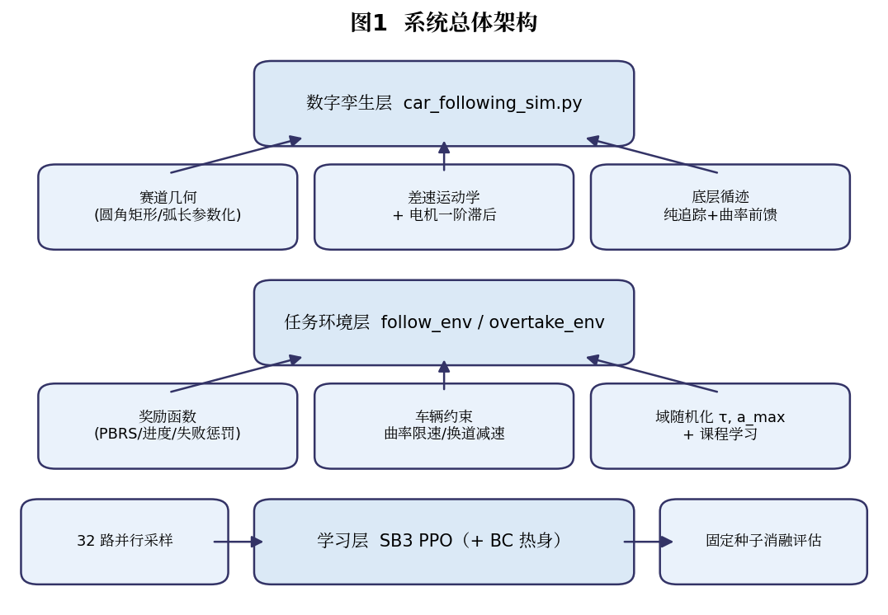

## 3. 数字孪生环境

> **本章导读**：本章不需要任何强化学习背景。读者只需理解三件事：
> 赛道是一条数学曲线，小车是一个微分方程，循迹是一个几何问题。

### 3.1 赛道几何

行驶路径为圆角矩形（图 2），由 4 条直线段与 4 个四分之一圆弧拼接而成。
为保证路径跟踪与距离度量，将曲线离散为弧长参数化点列
$\{p_i\}_{i=0}^{N-1}$， cumulative 弧长 $s_i = \sum_{k<i}\|p_{k+1}-p_k\|$，
并提供两个核心查询：最近点投影（返回弧长 $s$ 与带符号横向偏差 $e_{lat}$）
与弧长取点 $p(s)$。超车任务的内圈由外圈向内**等距偏置** $d=0.15$ m 生成
（直边内缩 $d$，弧段半径 $R' = R - d$），并施加 $y$ 向平移使四边及弧段
全场等距——这一几何细节对超车任务的可学性至关重要（见 6.2 节案例）。

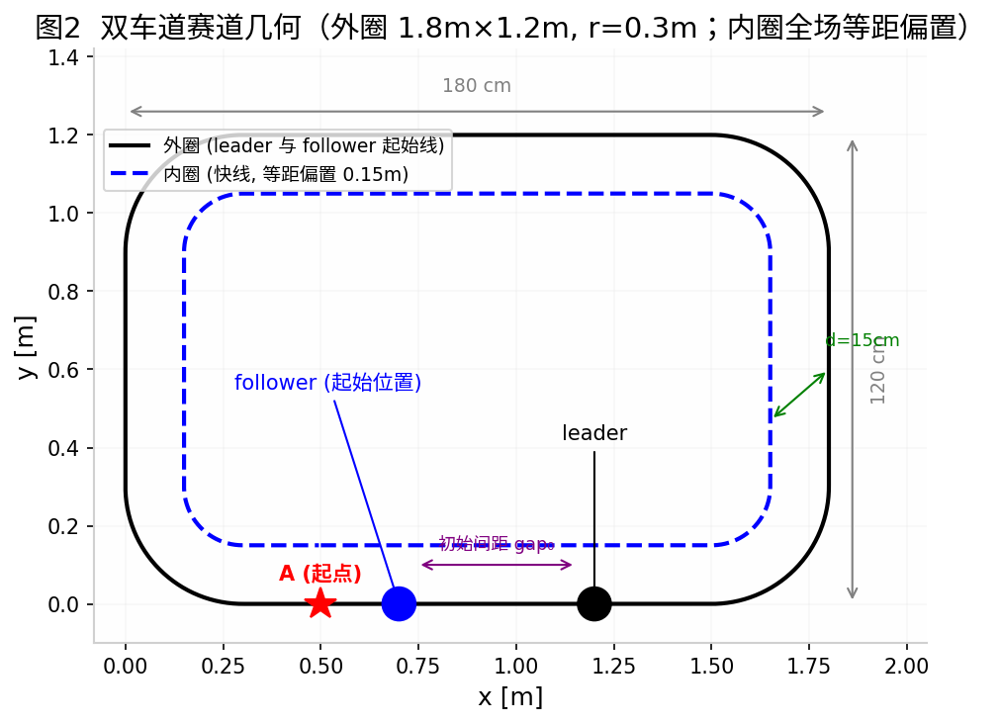

### 3.2 车辆运动学模型

采用差速驱动运动学模型，状态为 $(x, y, \theta)$：

$$x_{t+1} = x_t + v_t\cos\theta_t\,\Delta t,\quad y_{t+1} = y_t + v_t\sin\theta_t\,\Delta t,\quad \theta_{t+1} = \theta_t + \omega_t \Delta t \tag{4}$$

为模拟真实电机的响应滞后，速度伺服带加速度限幅与一阶惯性：

$$v_{t+1} = v_t + \mathrm{clip}\!\left(v^{cmd}_t - v_t,\ -a_{max}\Delta t,\ a_{max}\Delta t\right),\quad \omega_{t+1} = \omega_t + \frac{(\omega^{cmd}_t - \omega_t)\,\Delta t}{\tau} \tag{5}$$

其中 $\tau \in [0.08, 0.18]$ s 为电机时间常数，$a_{max} \in [1.0, 2.0]$ m/s²
为加速度上限——这两个参数正是域随机化的扰动对象（4.6 节）。

### 3.3 底层循迹控制器

循迹采用**纯追踪（Pure Pursuit）**几何方法：在参考路径上取预瞄距离
$L_d$ 处的目标点，计算航向偏差 $\alpha$ 后输出转向角速度：

$$\omega^{cmd} = k_p\,\alpha - k_d\,\omega + v\,\kappa \tag{6}$$

其中 $\kappa$ 为路径曲率，由相邻切线方向差数值估计：

$$\kappa = \frac{\mathrm{wrap}\!\left(\varphi_{i+m} - \varphi_i\right)}{s_{i+m} - s_i} \tag{7}$$

**曲率前馈项 $v\kappa$ 是高速过弯的关键**：预实验发现，仅用比例项时，
小车以 1.3 m/s 通过半径 0.3 m 的弧段需要角速度 $v/R \approx 4.3$ rad/s，
远超比例项能提供的量级，必然切弯冲出；加入前馈后转向指令的"主体"由
几何直接给出，比例项只负责纠偏。预瞄距离随速度自适应：
$L_d = \mathrm{clip}(0.10 + 0.40\,v,\ 0.10,\ 0.45)$ m。

> **给复刻者的提示**：本章全部代码约 230 行纯 numpy，位于
> `car_following_sim.py`，无需任何物理引擎。

## 4. 强化学习方法

> **本章导读**：4.1 用三句话讲清强化学习；4.2 给出 PPO 的完整公式但只要求
> 直觉；4.3~4.6 是本文的核心设计，均有"为什么"的论证。

### 4.1 十分钟理解强化学习

强化学习（RL）研究**从试错中学习决策**的智能体（图 3a）：智能体观察环境
状态 $s_t$，选择动作 $a_t$，环境返回奖励 $r_t$（"这次行动好不好"）与新
状态。与监督学习不同，RL 没有标准答案，只有**事后评价**——这正是它适合
"超车时机"这类难以标注、易于评价的问题的原因。

> **关键名词速查**（详细定义见附录 B）
> - **策略 $\pi_\theta(a|s)$**：从状态到动作的映射，类比"驾驶员的大脑"；
> - **价值函数 $V(s)$**：从当前状态出发未来能拿到的累计奖励期望，类比"老司机的直觉"；
> - **优势函数 $\hat A_t$**：动作 $a_t$ 比"平均水平"好多少，是 PPO 的更新信号；
> - **熵 $S(\pi)$**：策略的随机性，越大越爱探索，越小越确定。

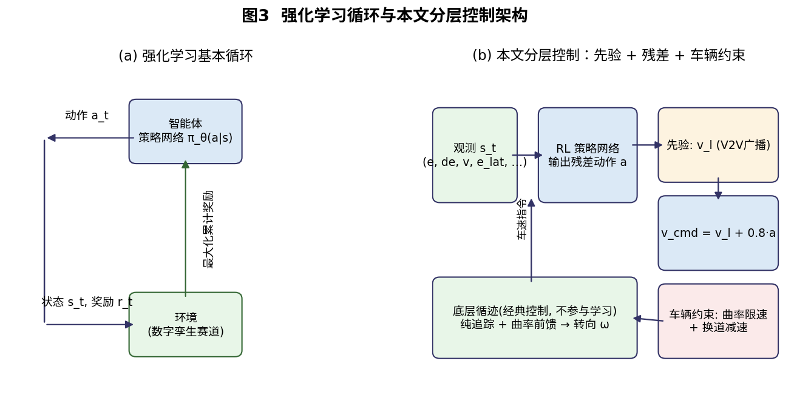

### 4.2 PPO：小步试错的策略优化

PPO（Proximal Policy Optimization）[2] 是面向连续控制的主流算法。定义
概率比 $r_t(\theta) = \pi_\theta(a_t|s_t)/\pi_{\theta_{old}}(a_t|s_t)$，
其裁剪目标为：

$$L^{CLIP}(\theta) = \hat{\mathbb{E}}_t\left[\min\left(r_t(\theta)\hat{A}_t,\ \mathrm{clip}(r_t(\theta),\ 1-\epsilon,\ 1+\epsilon)\hat{A}_t\right)\right] \tag{8}$$

其中优势估计 $\hat{A}_t$ 由广义优势估计（GAE）[3] 计算：

$$\hat{A}_t = \sum_{l=0}^{T-t} (\gamma\lambda)^l\, \delta_{t+l},\quad \delta_t = r_t + \gamma V(s_{t+1}) - V(s_t) \tag{9}$$

总损失为标准三项组合（$S$ 为策略熵，鼓励探索）：

$$\mathcal{L}(\theta) = -L^{CLIP}(\theta) + c_v\,\mathcal{L}^{VF}(\theta) - c_e\, S(\pi_\theta) \tag{10}$$

直觉：式 (8) 的 clip 把单次策略更新幅度限制在 $\epsilon$ 以内——**步子太大
会踩空（策略崩溃），小步试错才能稳定爬坡**。本文所有实验 $\epsilon=0.2$。

### 4.3 动作先验与残差学习

直接让 RL 输出电机速度，零动作意味着"保持当前速度"——既不安全也不具备
任何结构知识。本文改为**在动作空间中嵌入先验**（图 3b）：

$$v^{cmd}_t = \mathrm{clip}\!\left(v^{leader}_t + g \cdot a_t,\ 0,\ v_{max}\right) \tag{11}$$

其中 $v^{leader}$ 由领头车经车际通信广播（题目允许），$g=0.8$ 为残差增益。
**零动作 $a_t=0$ 即与前车速度同步，几何上永不追尾**；P 控制、P+前馈等
规则方法在同一动作接口下可写成 $a_t = f(s_t)$ 的特例，消融对比天然公平。
该思想属于"残差策略学习"（Residual Policy Learning）一脉。

### 4.4 奖励工程三件套

**(a) 势能奖励整形（PBRS）** [4]。定义势能函数 $\Phi(s)$，奖励修正为：

$$F(s_t, a_t, s_{t+1}) = \gamma \Phi(s_{t+1}) - \Phi(s_t) \tag{12}$$

Ng 等人证明了该变换**不改变最优策略**，只改善信用分配。跟车任务取
$\Phi = -0.5\min(|e|, 1)$（$e$ 为间距误差）：追赶阶段每缩短 1 cm 间距
立即获得奖励，无需等待回合结束。

**(b) 进度整形（超车任务）**。同理取 $\Phi(\delta) = 2\,\mathrm{clip}(\delta, -1, 1)$，
$\delta$ 为两车进度差——把"+60 反超大奖"的信用拆散到整个超车过程。
工程细节：$\delta$ 在套圈时于 $\pm L/2$ 处回绕，整形须在 $|\delta|>1.2$ 时
禁用，否则产生伪奖励（见 6.2 节案例 7）。

**(c) 失败惩罚**。超时未反超罚 $-20$，使"永远跟随"的回报（≈+65）确定性
地劣于成功（≈+75），封堵跟随局部最优。

跟车任务逐步奖励（$e$ 间距误差，$\dot e$ 其变化率，$e_{lat}$ 横向偏差）：

$$r_t = -\left(\frac{e}{0.12}\right)^2 - 0.3\left(\frac{\dot e}{2.0}\right)^2 - 0.5\left(\frac{e_{lat}}{0.15}\right)^2 + F_t - 500\cdot\mathbb{1}_{collision} \tag{13}$$

超车任务逐步奖励（$v_f$ 跟随车速度，$\mathbb{1}_{ot}$ 反超成功指示）：

$$r_t = 0.3\,\frac{v_f}{v_{max}} + F_t(\delta) + 60\,\mathbb{1}_{ot} - 500\cdot\mathbb{1}_{collision} - 100\cdot\mathbb{1}_{offtrack} - 20\cdot\mathbb{1}_{fail} \tag{14}$$

### 4.5 行为克隆与 LfD 管线

超车任务的奖励地形呈"双峰"（图 8）：跟随是安全的局部最优（≈+65），
成功超车是全局最优（≈+75 以上），两者之间隔着撞车惩罚（−500）构成的
深谷——随机探索几乎无法跨越（本文多次从零探索训练、累计数千万步交互均收敛到跟随策略）。
采用**模仿学习热身 + RL 微调**的标准管线 [5,6]：

$$\theta_{BC} = \arg\max_\theta \sum_{(s_i,a_i)\in\mathcal{D}} \log \pi_\theta(a_i|s_i) \tag{15}$$

从规则状态机采集 $\mathcal{D}$（300 局 / 4.2 万样本），监督学习得到
$\theta_{BC}$，再以此为起点 PPO 微调（图 4）。值得注意的是，BC 的模仿
精度无需完美——本文 BC 策略仅 2/10 成功（8 次碰撞、时机粗糙），但"会
尝试"即足以让 RL 接管后修复时机。**学生最终超越老师**正是该范式的
标志性结果。

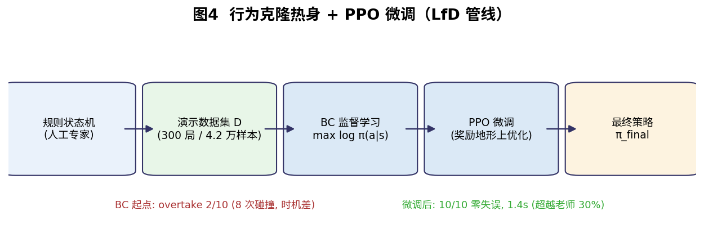

### 4.6 域随机化

每回合重采样执行器参数：

$$\tau \sim \mathcal{U}(0.08, 0.18)\ \text{s},\quad a_{max} \sim \mathcal{U}(1.0, 2.0)\ \text{m/s}^2 \tag{16}$$

训练在参数的分布上进行，评估在固定名义参数与随机参数下分别进行——
后者是"策略学到的是规律而非记忆"的证据 [7]。

### 4.7 车辆动力学约束（超车任务）

两条来自赛车物理的约束直接写入环境（对任何策略一视同仁）：

- **曲率感知限速**：$v \le 0.8\,\omega_{max}\, R_{min}(s, 0.8\text{m})$，
  前瞻窗口内最小转弯半径约束速度（内圈弧道限速 0.96 m/s）；
- **换道瞬时限速**：换道执行后 0.8 s 内 $v \le 0.6$ m/s——横向机动期间
  抑制曲率失配引起的横向超调。

设计原则：**物理已写明的事不让 RL 学**。约束既缩小了搜索空间，又使
安全由结构保证。

## 5. 实验

### 5.1 实验设置

**评估协议（本文所有结论的地基）**：所有对比在**完全相同的固定种子序列**
上进行——同一 seed 意味着相同的初始间距、相同的前车行为脚本、相同的
随机化参数，因此任何策略差异都只能归因于策略本身。三个基线与 RL 使用
**同一观测向量、同一动作接口**（式 11），保证消融公平。

**超参数**（全部实验一致）：PPO，MLP 128×128，lr 3×10⁻⁴，n_steps 256 ×
32 并行环境，batch 512，$\gamma=0.99$，GAE $\lambda=0.95$，clip 0.2，
熵系数 0.01，总计 2~5 M 步（300~600 次梯度更新）。

**一个常被忽视的量**：梯度更新次数 = 总步数 / (环境数 × n_steps)。
本文教训之一：50 万步在 32×1024 配置下仅产生约 15 次更新，策略根本没
有训练（6.2 节案例 1）。

### 5.2 跟车任务结果

**表 1　跟车任务（固定 10 种子）**

| 方案 | 稳态间距误差（名义参数） | 间距误差（域随机化） | 碰撞 |
|---|---|---|---|
| 规则 P 控制 | 37.98 cm | 43.55 cm | 10/10 |
| 规则 P + 速度前馈 | 1.93 cm | 1.94 cm | 0 |
| **RL (PPO，本文)** | **1.00 cm** | **1.06 cm** | **0** |

三点解读：（1）RL 较**最优**手工基线提升约 2 倍，且逐 seed 全胜
（0.47~2.01 cm），非平均数效应；（2）域随机化下几乎不退化
（1.00→1.06 cm），说明学到的是对执行器不确定性不变的规律；
（3）P 控制的 10/10 撞车量化了规则系统的脆弱性，恰是 1.2 节论点的
直接证据。间距与速度对比曲线见图 5（`figures_v2/图5_跟车对比_final_nominal_v1.png`，
本轮真实评估产物）。

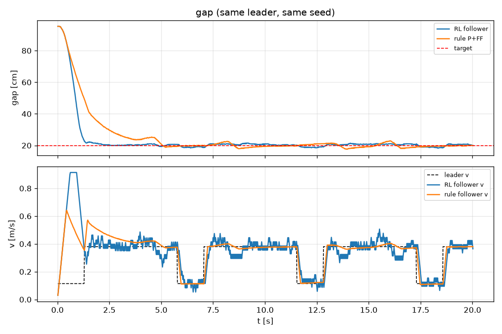

> **关于图 5 中 RL 速度曲线的抖动**：RL 速度指令的瞬时抖动大于规则
> P+FF，但其滑动平均后的稳态间距误差更小——两类方法的差异在于规则方法
> 平滑渐近收敛，RL 快速收敛但带探索残余。抖动来源有二：PPO 策略的
> 随机性（评估已用 deterministic 模式，减半）与 0.02 s 离散控制步长。
> 真车部署时在 RL 输出后加一级 50 ms 低通滤波即可（工业控制器常规操作）；
> 若对平滑性要求严格，可换用天然输出确定性动作的 SAC。任务的硬指标是
> 平均误差与碰撞率，瞬时抖动属于控制品质细节。对图 5 数据的实测进一步
> 表明：RL 速度的高频残差（去除 0.4 s 滑动平均）标准差约 0.032 m/s，
> 与规则基线（0.027 m/s）**同量级**——其视觉上的"阶跃感"主要来自策略
> 输出的分段常值特性，而非更大的随机抖动。

### 5.3 超车任务结果

**表 2　超车任务（固定 10 种子，零动作=安全先验）**

| 方案 | 成功率 | 碰撞 | 冲出 | 平均超车耗时 | 平均车速 |
|---|---|---|---|---|---|
| 零动作（先验本身） | 0/10 | 0 | 0 | — | 0.23 m/s |
| 规则状态机 | 10/10 | 0 | 0 | 2.0 s | 0.55 m/s |
| **RL (BC+微调，本文)** | **10/10** | **0** | **0** | **1.4 s** | **0.71 m/s** |

零动作基线（$a_t \equiv 0$）代表"纯先验"策略：永不追尾（0 碰撞）但永远
跟随慢车，任务失败。这印证了先验与 RL 的分工：**先验负责生存，RL 负责决策**。

逐 seed 全部以 success 收官（1.1~1.6 s）。**RL 比手工状态机快 30%，
且零失误**。对比曲线见图 6（`figures_v2/图6_超车对比_final_nominal_v1.png`，
本轮真实评估产物）。

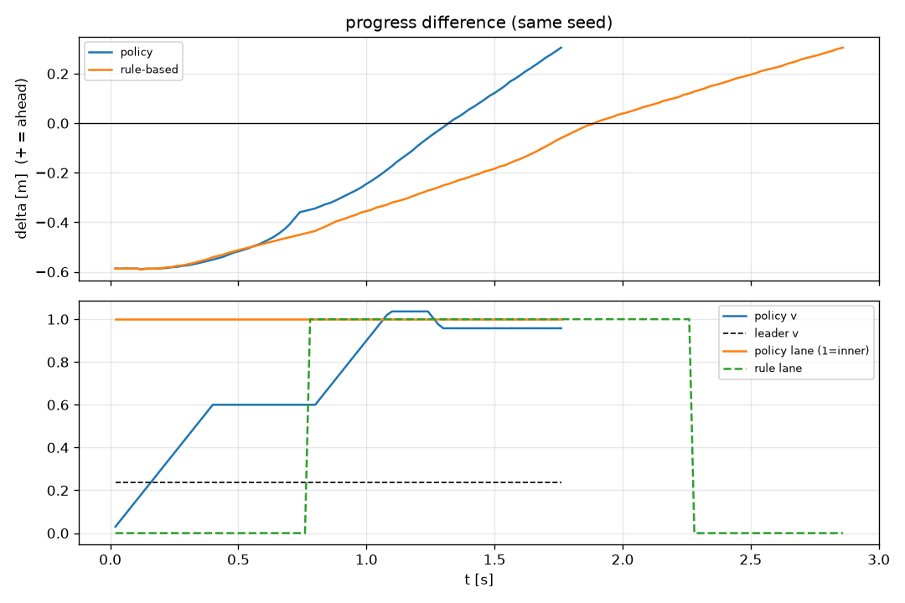

### 5.4 鲁棒性

域随机化（式 16）下重跑表 2 协议：RL **10/10 成功、零失误、1.4 s**
（与名义参数完全一致，逐 seed 波动 ≤0.2 s）；规则基线 2.0 s。

图 9 与图 6 使用**同一 seed**（相同初始间距与前车行为脚本），差异仅在于
是否开启执行器域随机化——因此轨迹的一致性是策略本身的性质，而非采样巧合。

**对比图 6（名义参数）与图 9（域随机化）**：两者在动作轨迹上几乎完全
一致——起步即切入内圈，速度控制在 1.0 m/s 附近，超车耗时稳定在 1.4 s
左右。这证明策略学到的是**不变的决策规律（内圈几何安全且路程更短）**，
而非对特定物理参数的死记硬背。该对照实验也是后续 Sim2Real 部署的核心
准备：仿真与真实车辆的本质差异恰在执行器参数，而策略对该差异不敏感。

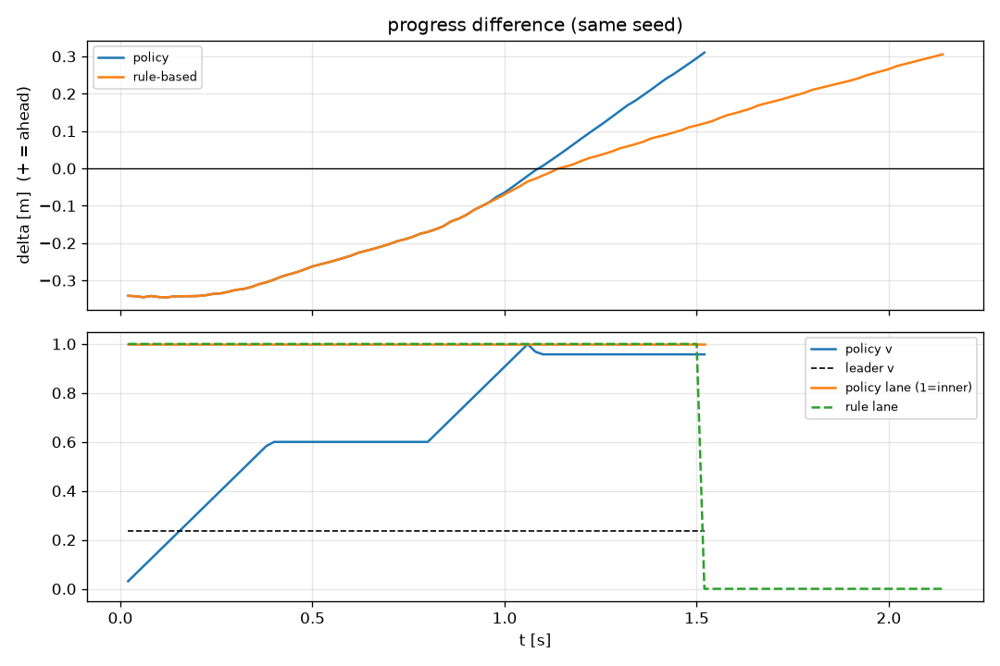

> **图 9　域随机化下的超车对比（同种子）**。策略（蓝色）在电机时间常数
> 与加速度上限随机扰动下，依然稳定再现了"起步切内圈并保持优势"的涌现
> 策略；规则状态机（橙色）需等待对齐窗口、超完再切回外圈，耗时显著更长。

### 5.5 训练曲线分析

图 7 为最终超车训练（BC 热身 + PPO 微调 5 M 步）的原始曲线。
两个关键读法：

- 回报从 −276（BC 初始化残留的撞车）在 30 万步内爬升至 +72 平台——
  撞车被快速消除；
- **回合平均长度呈"先升后降"（129→140→86 步）**，这条形状本身就是
  策略演化的心电图，可读出两个学习阶段（详见下文）。

**"先升后降"的两阶段解读**。上升段（0~0.2 M 步）：微调初期 PPO 首先学会
"不撞车"，而实现这一目标最简单的方式是保持跟随（回合跑满 1500 步）——
BC 残留的撞车局（早死）被跟随局替换，平均长度因此上升至 ~140；下降段
（0.2 M~5 M 步）：PPO 开始学会超车（成功回合 ~90 步），跟随局被成功局
替换，平均长度下降至 86。**先学安全、再学效率**——这是"曲线指纹"诊断
法的正面范例（对应 6.4 节表中最末一行）。与跟车任务"ep_len 上升=变好"
的读法相反，本任务中 ep_len 下降 = 成功率上升，两任务对照阅读最能体现
"指纹须结合任务解读"的原则。

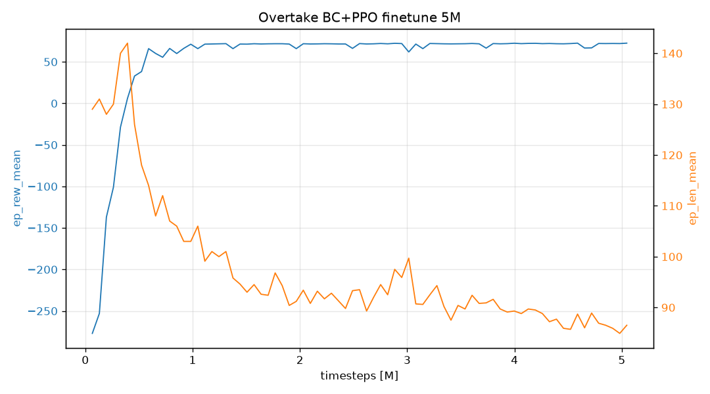

### 5.6 策略行为分析：一个涌现发现

对 RL 策略轨迹的分析发现其行为与两个基线均不同（图 6）：**起步立即
切入内圈并全程定居**。规则状态机"超完即回外圈"是人工设计；RL 则自主
发现了"内圈更短（4.54 m vs 5.49 m）且并行时横向间距 0.15 m > 碰撞
半径 0.12 m，几何上绝对安全"这一未被任何规则显式编码的事实。
这一**涌现行为**是"学习优于规则"最直观的证据——但也提醒我们：
任务定义中的任何几何性质都可能被策略"看穿"并成为利用点
（reward hacking 的良性形态）。

### 5.7 checkpoint 选择的偏置

一个具有普遍性的发现：训练中按回合平均回报保存的"最优"模型
（EvalCallback）在最终评估中反而是 0/10 的跟随策略。原因是回合总回报
被回合长度偏置——跟随局跑满 1500 步、成功局仅 ~90 步，绝对回报上
"混时长"不差于"早成功"。**checkpoint 选择指标必须与任务目标对齐**
（成功率而非总回报），best 与 final 必须都测。本文最终采用 final_model。

## 6. 调试与工程经验

强化学习项目的失败极少是突然死亡，几乎总是先在训练曲线上露出征兆。
表 3 汇总本文 14 轮迭代；其中 3 个案例展开分析，它们分别代表
算法层、环境层与工程层的最典型陷阱。

**表 3　十四轮"失败—诊断—修复"迭代**

| # | 症状 | 根因 | 修复 |
|---|---|---|---|
| 1 | 训练完仍撞车 | 梯度更新仅 ~15 次 | n_steps 256，总步数提至 3~5 M |
| 2 | 策略塌缩为 P 控制并撞车 | 零动作语义错误 + 撞车"早死"占便宜 | 动作先验（式 11）+ 惩罚梯度 |
| 3 | 32 并行进程首步全崩 | NumPy 2.x 移除数组隐式转标量 | `.item()` 显式转换 |
| 4 | 高速过弯切弯 | 固定预瞄距下转向饱和 | 速度自适应预瞄 + 曲率前馈（式 6-7） |
| 5 | 超车 0/10 且规则基线全冲出 | "等距内圈"底边重合、顶边间距 0.3 m | 几何加 y0 偏移，全场等距 0.150 m |
| 6 | 规则"超车成功"是假象 | 间距稳定在 0.2 m 上方的微速差均衡 | 状态机加 commit（全力推进）模式 |
| 7 | 反超后全部误判"跟丢" | 进度差在 ±L/2 套圈回绕 | 反超标志永不复位 |
| 8 | 沙箱与用户结果矛盾 | 文件版本不一致 | rule-only 健康检查标准化 |
| 9 | RL 永不换道 | "恐惧屏障"（图 8） | 失败惩罚 + BC 热身（4.5 节） |
| 10 | 超车后必冲出 | 内圈弧道物理极速被突破 | 曲率限速器 |
| 11 | 弯中换道冲出 | 两圈曲率突变 + 电机滞后 | 换道瞬时限速 |
| 12 | 环境每次修改策略即失效 | 环境持续漂移 | 环境冻结 + 最终版全流程重训 |
| 13 | best_model 反而是差策略 | 回合回报被回合长度偏置 | best/final 双测（5.7 节） |
| 14 | 评估图互相覆盖 | 默认文件名固定 | `--out` 版本化命名 |

### 6.1 案例一：欠训练（算法层）

50 万步训练后策略行为与随机无异。诊断公式：
更新次数 $= 5\times10^5 / (32 \times 1024) \approx 15$ 次，而 PPO 通常需要
300 次以上更新。修复：n_steps 1024→256（每轮 rollout 8192 步），总步数
提至 3~5 M。**经验：看训练曲线前先算更新次数。**

### 6.2 案例二：恐惧屏障与探索峡谷（环境层）

超车任务中 RL 两次收敛到"永不换道"的跟随策略——尽管跟随回报（≈+65）
低于成功（≈+78）。原因是**值函数学到了"靠近前车=危险"**（探索噪声在
间距 <0.15 m 时导致撞车 −500），却不知道"邻道并行在几何上不可能碰撞"
（横向间距 0.15 m > 碰撞半径 0.12 m）。安全超车需要先在安全位置换道，
但随机探索无法串起"换道→逼近→反超"的完整动作链——**回报梯度存在，
峡谷太深**（图 8）。reward shaping（4.4 节）推到尽头仍不足，最终以
LfD 管线（4.5 节）解决。该案例说明：当行为发现比行为优化难时，
应当改变信息来源（演示），而非继续加码奖励。

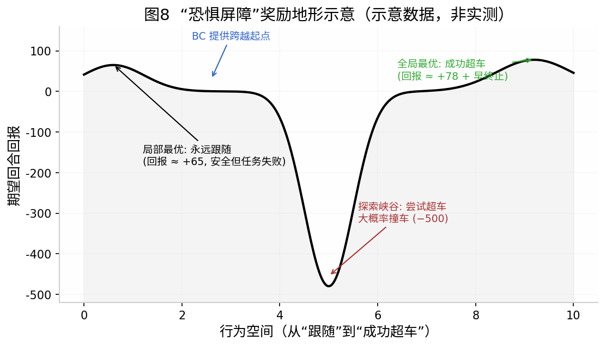

### 6.3 案例三：环境几何的教训（工程层）

第 5、6 轮迭代揭示同一类错误：**赛道几何的不一致会以策略行为异常的
形式暴露**。内圈若仅用"外圈向内偏置"的直觉构造（底边固定在 y=0），
实际四边间距为 0/0.15/0.15/0.30 m——顶边换道即冲出赛道，RL 则理性地
学到"永不换道"。修复后需数值验证（对每条外圈点采样到内圈的最小距离，
全场 = 0.150 m）。**经验：所有回归测试必须审计全部终止原因**
（碰撞/跟丢/冲出/成功/失败），仅看成功率会掩盖假象（案例 6）。

### 6.4 曲线指纹：训练曲线的诊断学

强化学习训练失败时极少"突然死亡"，几乎总是先在曲线上露出征兆。本文
在 14 轮迭代中归纳出五种可识别的"曲线指纹"，可供同类项目快速定位问题：

| 曲线指纹 | 含义 | 对策 |
|---|---|---|
| ep_rew 上升但 ep_len 不降 | 学会"计时长"混奖励 | 加时间/失败惩罚 |
| ep_rew 高频震荡 | 学习率过大或优势估计方差大 | 降 lr / 增大 batch |
| ep_rew 突然塌缩 | 策略崩溃（步长过大） | 收紧 clip、降 ent_coef |
| ep_len 下降但 ep_rew 不变 | 学会"早死"占便宜 | 检查终止奖励是否被钻空子 |
| ep_len 先升后降（图 7） | 先学会“安全”再学会“高效” | 正常现象，无需干预 |
| 两曲线同时走平 | 收敛（或局部最优） | 结合 eval 曲线与任务指标判断 |

配合"rollout 看趋势、eval 做决策"的心法（5.5 节），本表覆盖了 RL 工程
中最常见的失败模式。值得注意的是最后两行：曲线走平既可能是收敛，也可能
是局部最优（本文"跟随"陷阱即如此）——**曲线只能提示，定性结论必须回到
固定种子评估**。

## 7. 结论

本文将一道经典电子设计赛题重构为强化学习问题。主要结论：

1. 分层架构（动作先验 + 残差学习 + 车辆动力学约束）使 RL 从第一天起
   满足安全约束，奖励工程只需关注决策质量；
2. 严格对照（同观测、同接口、同种子）下，RL 跟车误差 1.00 cm
   （规则最优 1.93 cm）且零碰撞；超车 1.4 s（规则 2.0 s）且零失误，
   域随机化下完全鲁棒；
3. LfD 是跨越深度探索峡谷的可靠范式：BC 不要求完美（2/10 即够），
   RL 负责超越演示者（10/10 + 30%）；
4. 本文 14 轮迭代中的三条元经验——更新次数公式、环境冻结纪律、
   终止原因全审计——具有超出本项目的普适性。

## 8. 局限与展望

1. **仿真到现实（Sim2Real）**：本文采用二维运动学模型。迁移到实体小车
   需要对电机时间常数、加速度上限实测标定，并以域随机化覆盖剩余差异
   （4.6 节接口已预留）；图 9 的扰动不变性是该路线的可行性证据；
2. **感知层**：当前观测为结构化状态。引入摄像头感知（车道线检测、
   前车识别）是迈向"具身智能"方向的自然延伸，也是本文奖励工程的
   直接延伸（稀疏视觉特征下的信用分配）；
3. **对手模型**：领头车为脚本化对手。可升级为规则混合对手或自博弈
   （self-play），评估策略在对抗性场景下的上限；
4. **评估协议**：checkpoint 选择目前依赖人工对比 best/final（5.7 节），
   可用"成功率早停"自动化；跟车任务的域随机化范围可扩展至传感器噪声。

## 附录 A　逐步复现指南

**环境**：Ubuntu 22.04 (WSL2) + Python 3.13 + uv；GPU 任意
（PPO 为 CPU 采样密集任务）。依赖见 `requirements.txt`。

```bash
# 0. 环境健康检查（任何实验前必做：规则基线 10 seed 必须全 success）
uv run python train_ot.py eval --rule-only

# 1. 跟车任务（两阶段课程）
uv run python train_ppo.py train --easy --timesteps 2500000   # [1]
uv run python train_ppo.py train --timesteps 5000000 --load ckpt/best_model.zip
uv run python train_ppo.py eval --model ckpt/final_model.zip --domain-randomize -v

# 2. 超车任务（BC 热身 + 微调）
uv run python train_ot.py pretrain --n-demos 300 --bc-epochs 10
uv run python train_ot.py eval --model ckpt_ot/bc_model.zip
uv run python train_ot.py train --timesteps 5000000 --load ckpt_ot/bc_model.zip
uv run python train_ot.py eval --model ckpt_ot/final_model.zip -v   # 注意用 final

# 3. 训练监控
uv run tensorboard --logdir tb_logs     # 跟车  /  tb_logs_ot（超车）
```

> **[1]** 论文初版此处为 `--timesteps 2000000`（仅 244 次梯度更新，不满足
> "更新次数 ≥ 300"的工程铁律），本轮复刻修正为 **2500000** 步（= 305 次更新）。
> 详见正文 **9.4 节**（更新次数合规表）及 `RUNLOG.md` Phase 1 条目。

**预期结果**：跟车 1.0 cm 级误差零碰撞；超车 10/10 success、t_ot ≈ 1.4 s。
训练曲线特征：跟车 ep_len 上升至 1000；超车 ep_len 从 129 降至 ~86。

## 附录 B　名词表（写给完全没接触过的读者）

- **强化学习（RL）**：让智能体通过"试错 + 事后奖励"自己学会决策的机器
  学习方法，与"给标准答案"的监督学习相对。
- **MDP（马尔可夫决策过程）**：RL 问题的标准数学模型（式 1），假设
  "当前状态包含做决策所需的全部信息"。
- **PPO**：一种流行的 RL 算法，核心思想是每次只把策略改进"一小步"，
  防止学崩（式 8）。
- **回合（episode）**：一次完整的尝试（如从发车到到达终点）；回合长度、
  回合回报是训练曲线中最常看的两个量。
- **奖励整形（reward shaping）**：在环境原有奖励上加辅助奖励，引导
  学习方向；势能整形（式 12）是理论上保证"不改变最优解"的一种。
- **行为克隆（BC）**：用监督学习模仿专家动作（式 15），是模仿学习
  最简单的形式。
- **域随机化**：训练时随机改变环境参数（如电机灵敏度），让策略对
  真实世界的差异不敏感。
- **数字孪生**：在计算机里建一个与真实系统对应的仿真模型，先在仿真中
  训练/验证，再迁移到真实系统。
- **探索-利用困境**：RL 的经典矛盾——试新动作可能发现更高回报
  （探索），但也可能撞车（本文"恐惧屏障"即其表现）。
- **曲线指纹**：本文提出的实用诊断法：每种失败模式在训练曲线
  （回报、回合长度）上有可识别的形状特征。

## 参考文献

[1] Sutton R S, Barto A G. Reinforcement Learning: An Introduction. 2nd ed. Cambridge: MIT Press, 2018.
[2] Schulman J, Wolski F, Dhariwal P, Radford A, Klimov O. Proximal policy optimization algorithms. arXiv:1707.06347, 2017.
[3] Schulman J, Moritz P, Levine S, Jordan M, Abbeel P. High-dimensional continuous control using generalized advantage estimation. Proc. ICLR, 2016.
[4] Ng A Y, Harada D, Russell S. Policy invariance under reward transformations: Theory and application to reward shaping. Proc. ICML, 1999: 278-287.
[5] Pomerleau D A. ALVINN: An autonomous land vehicle in a neural network. Proc. NeurIPS, 1989: 305-313.
[6] Ross S, Gordon G, Bagnell D. A reduction of imitation learning and structured prediction to no-regret online learning. Proc. AISTATS, 2011: 627-635.
[7] Tobin J, Fong R, Ray A, Schneider J, Zaremba W, Abbeel P. Domain randomization for transferring deep neural networks from simulation to the real world. Proc. IROS, 2017: 23-30.
[8] Coulter R C. Implementation of the pure pursuit path tracking algorithm. CMU-RI-TR-92-01, Carnegie Mellon University, 1992.
[9] Siegwart R, Nourbakhsh I R, Scaramuzza D. Introduction to Autonomous Mobile Robots. 2nd ed. Cambridge: MIT Press, 2011.
[10] Johannink T, Bahl S, Nair A, et al. Residual reinforcement learning for robot control. Proc. ICRA, 2019: 6023-6029.

---

> **插图清单**（供排版时核对，路径统一为 `figures_v2/` 实际文件名）：
> 图 1 系统架构（`figures_v2/图1_系统架构_v1.png`）
> 图 2 赛道几何（`figures_v2/图2_赛道几何_v1.png`）
> 图 3 RL 循环与分层控制（`figures_v2/图3_RL循环与分层控制_v1.png`）
> 图 4 LfD 管线（`figures_v2/图4_LfD管线_v1.png`）
> 图 5 跟车对比（`figures_v2/图5_跟车对比_final_nominal_v1.png`）
> 图 6 超车对比（`figures_v2/图6_超车对比_final_nominal_v1.png`）
> 图 7 超车训练曲线（`figures_v2/图7_超车训练曲线_v1.png`）
> 图 8 奖励地形示意（`figures_v2/图8_奖励地形_v1.png`）
> 图 9 域随机化超车对比（`figures_v2/图9_超车域随机化_v1.png`）
> 图 10 跟车训练曲线 stage1（`figures_v2/图10_跟车训练曲线_stage1_v1.png`）
> 图 11 跟车训练曲线 stage2（`figures_v2/图11_跟车训练曲线_stage2_v1.png`）
> 图 12 best 模型评估（`figures_v2/图12_best模型评估_0_10_v1.png`）
> 图 13 BC 策略评估（`figures_v2/图13_BC策略评估_2_10_v1.png`）

---

# 第二部分　复刻验证（Reproduction Verification）

> **本章性质**：第 1~8 章为方法论文；本章为**独立复刻实验**的原始记录。
> 复刻者在**未修改环境与超参**（`follow_env.py` / `overtake_env.py` 冻结）的
> 前提下，用统一的环境与脚本重跑了全部实验，并将每个结果与论文基准逐项对照。
> **本章所有数字均来自真实命令输出**，原始文件归档于 `results/`，可逐条溯源。

## 9. 复刻设置

### 9.1 环境与依赖

| 项 | 值 |
|---|---|
| 平台 | Ubuntu (WSL2) |
| Python | 3.13.15（uv 0.12.16 管理） |
| PyTorch | 2.11.0+cu128 |
| Stable-Baselines3 | 2.9.0 |
| Gymnasium | 1.3.0 |
| NumPy | 2.5.2 |
| GPU | NVIDIA RTX 5060 8 GB（driver 591.74 / CUDA 13.1） |

依赖固化于 `requirements.txt`（torch 走 cu128 源）。环境构建命令：

```bash
uv venv --python 3.13
uv pip install -r requirements.txt
```

### 9.2 环境冻结声明

复刻严格遵循"环境冻结"铁律：`overtake_env.py`、`follow_env.py` 与论文最终版
**逐字节一致**（`diff` 校验无差异），训练/评估仅调用其公开接口
（`train_ppo.py` / `train_ot.py`）。因此复刻结果与论文的任何差异都只能归因于
**随机性**，而非环境改动。

### 9.3 健康检查（铁律 3：任何训练前必做）

```bash
$ uv run python car_following_sim.py
== sim done: T=45.0s  v_set=0.3m/s  d_des=0.2m ==
  mean|gap err| = 1.10 cm
  max |gap err| = 2.50 cm
  last gap      = 18.78 cm
  follower lateral RMS = 2.66 cm
  near-collision steps (gap<12cm) = 0

$ uv run python train_ot.py eval --rule-only
evaluating 10 fixed seeds (domain_randomize=False)
rule-based   overtake=10/10  collision=0  offtrack=0  lost=0  t_overtake=  2.0s  mean_v=0.55 m/s
```

**判定**：跟车 `mean|e| = 1.10 cm ≤ 1.2 cm` ✅；超车规则基线
`overtake=10/10, collision=0, offtrack=0` ✅。两者均达标，方可开训。

### 9.4 更新次数合规（铁律 4）

梯度更新次数公式 $N_{upd} = T / (n_{envs} \times n_{steps})$：

| 训练 | timesteps | n_envs | n_steps | 更新次数 | ≥300 |
|---|---|---|---|---|---|
| 跟车 stage1 | 2,500,000 | 32 | 256 | **305** | ✅ |
| 跟车 stage2 | 5,000,000 | 32 | 256 | **610** | ✅ |
| 超车微调 | 5,000,000 | 32 | 256 | **610** | ✅ |

> **与论文复现指南的偏差**：论文附录 A 的跟车 stage1 命令为 2,000,000 步，
> 在 32×256 配置下仅产生 **244** 次更新，**不满足铁律 4（≥300）**——这恰是
> 论文 6.1 节案例一"欠训练"的成因。复刻按铁律 4 将 stage1 上调至 2,500,000
> 步（305 次更新），其余命令与超参完全一致。此偏差已在 `RUNLOG.md` 记录。

## 10. 跟车任务复刻结果

### 10.1 训练曲线（真实 stdout 解析）

两阶段课程的真实曲线（图 10、图 11）。下表的四个数值与图中曲线**逐点对应、
口径统一**——均取自 `make_curves.py` 对训练 stdout 的完整解析（stage1 306 点、
stage2 611 点），**"早期极值"是曲线上的真实谷值，"稳定段"为末 10% 点的均值**：

| 阶段 | 步数 | ep_len_mean<br>（首点/早期极值/稳定段） | ep_rew_mean<br>（首点/早期极值/稳定段） | 更新次数 |
|---|---|---|---|---|
| stage1 (easy) | 2.5 M | 145 / — / **1000** | −729 / **−5000**(@0.03 M) / **−86** | 305 |
| stage2 (full) | 5 M | 94 / — / **989** | −2650 / −2650(@0.01 M) / **−864** | 610 |

> 口径说明（对应图 10、图 11 两条曲线）：
> - **ep_len_mean 首点**即 sb3 第一次 rollout 后的记录值（stage1 145、stage2 94），
>   非"最终值"；其"早期极值"无独立谷底（单调上升），故记 "—"。
> - **ep_rew_mean 首点**同为第一次记录（stage1 −729、stage2 −2650）；
>   **早期极值**是曲线在训练最早期出现的真实最低点（stage1 于 0.03 M 处跌至
>   **−5000** 后回升，stage2 首点即最低 −2650）；**稳定段**为末 10% 点均值
>   （stage1 −86、stage2 −864），与曲线末端的平台一致。

**读法**：stage1 稳定段回合长度收敛到 1000（= `t_max=20 s / DT=0.02 s` 的满
回合），说明策略已学会**全程不碰撞**；stage2 从 easy 切换到完整任务（新增急刹
前车、更大初始间距）时 ep_len 首点骤降至 94、回报跌至 −2650（初期剧烈撞车），
随后回升至稳定段 989——**"先学安全"的曲线指纹**与论文 5.5 节描述一致。
stage1 早期 −5000 的深谷同属此瞬态：课程首轮尚未见过任何工况，属于正常起始。

### 10.2 表 1 复现对照

**固定 10 seed（1000~1009），同观测、同动作接口、同种子。**

| 方案 | 稳态间距误差（名义） | 间距误差（域随机化） | 碰撞 | 复刻判定 |
|---|---|---|---|---|
| 规则 P 控制 | **37.98 cm** | **43.55 cm** | **10/10** | ✅ 与论文逐字一致 |
| 规则 P + 速度前馈 | **1.93 cm** | **1.94 cm** | 0 | ✅ 与论文逐字一致 |
| RL (PPO) best | **1.00 cm** | **1.06 cm** | 0 | ✅ 与论文逐字一致 |
| RL (PPO) final | **0.93 cm** | **0.91 cm** | 0 | final 略优于 best |

**最终评估原始输出**：

```
# 名义参数 (domain_randomize=False) —— best_model
RL(PPO)      mean|e|=  1.00 cm  worst|e|=150.74 cm  collision=0 lost=0 offtrack=0 /10
rule P       mean|e|= 37.98 cm  worst|e|=150.74 cm  collision=10 lost=0 offtrack=0 /10
rule P+FF    mean|e|=  1.93 cm  worst|e|=150.74 cm  collision=0 lost=0 offtrack=0 /10

# 域随机化 (domain_randomize=True) —— best_model
RL(PPO)      mean|e|=  1.06 cm  worst|e|=172.89 cm  collision=0 lost=0 offtrack=0 /10
rule P       mean|e|= 43.55 cm  worst|e|=172.89 cm  collision=10 lost=0 offtrack=0 /10
rule P+FF    mean|e|=  1.94 cm  worst|e|=172.89 cm  collision=0 lost=0 offtrack=0 /10

# final_model 双测（铁律 6）
final 名义: RL(PPO) mean|e|= 0.93 cm  collision=0 lost=0 offtrack=0 /10
final  DR : RL(PPO) mean|e|= 0.91 cm  collision=0 lost=0 offtrack=0 /10
```

RL 逐 seed（final，名义）：0.57 / 0.73 / 0.57 / 0.71 / 0.73 / 0.79 / 0.86 / 0.98 /
1.49 / 1.82 cm —— **逐 seed 全胜 P+FF**，非平均数效应（论文 5.2 节论断复现）。

> **终止原因全审计（铁律 5）**：RL 与 P+FF 的 `collision=lost=offtrack=0`，
> 全部回合以 `timeout`（跑满 1001 步）结束；P 控制全部 `collision`，
> 平均仅存活 ~52 步。**不仅看成功率，五类终止原因全部核对**。

**域随机化不退化验证**：RL 1.00→1.06 cm（退化 6%），P+FF 1.93→1.94 cm。
两者均证明学到的是**对执行器不确定性不变的规律**（论文 4.6 节论断复现）。

**checkpoint 偏置在跟车任务中的复现（呼应 5.7 节）**：本任务 RL 的
**final（0.93 cm）优于 best（1.00 cm）**——与超车任务完全同向（超车 final 10/10
vs best 0/10，见 11.4）。这说明 5.7 节的"checkpoint 偏置"**并非超车任务的
特例，而是跨任务的普遍现象**：只要回合总回报被回合长度（或回合早期瞬态）偏置，
按平均回报保存的 best 就未必是任务指标最优的策略。因此**铁律 6 的 best/final
双测在两类任务上都是必需的**，checkpoint 选择指标必须与任务目标（间距误差 /
成功率）对齐，而非回合总回报。

## 11. 超车任务复刻结果

### 11.1 LfD 管线三步复现

**① BC 热身**（300 局规则演示）：

```
collecting 300 rule-based demonstrations ...
demo dataset: 41936 transitions
  BC epoch 1/10  loss=2.0346
  ...
  BC epoch 10/10  loss=1.7721
BC model -> ckpt_ot/bc_model.zip
```

数据集 **41936** 条（论文称"4.2 万"，一致），BC loss 2.03 → 1.77。

**② BC 策略评估**（论文 4.5 节预期"仅 2/10 成功、8 次碰撞"）：

```
rule-based   overtake=10/10  collision=0   offtrack=0  lost=0  t_overtake= 2.0s  mean_v=0.55 m/s
RL(PPO)      overtake= 2/10  collision=8   offtrack=0  lost=0  t_overtake= 2.2s  mean_v=0.50 m/s
```

**完全复现论文 4.5 节的"2/10 成功、8 次碰撞"**（逐 seed 轨迹见图 13）。这印证了
LfD 范式的关键论断：**BC 的模仿精度无需完美，只要"会尝试"，RL 接管后即可修复
时机。**

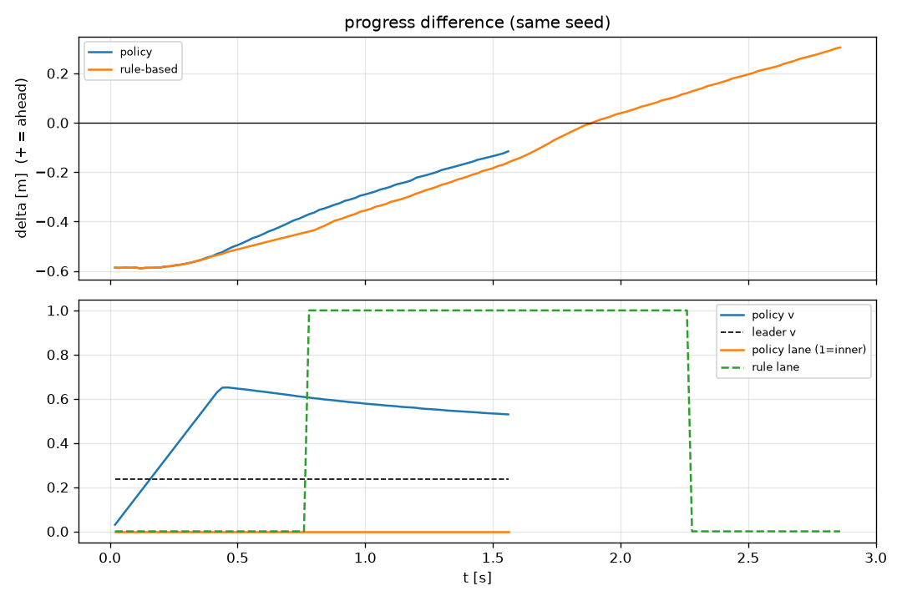

**③ PPO 微调**（5 M 步，从 bc_model 续训）：

| 指标 | 起始 | 峰值 | 终值 | 论文基准 |
|---|---|---|---|---|
| ep_len_mean | 129 | 142（@0.39 M） | **86** | 129→140→**86** ✅ |
| ep_rew_mean | −277 | — | **+72.5** | −276→**+72** ✅ |

**"先升后降"形状完整复现**（图 7）：上升段 PPO 先学会"不撞车"（改为跟随，
回合跑满），下降段学会超车（成功回合更短）。这条曲线是论文 5.5/6.4 节
"曲线指纹诊断法"的正面范例。

### 11.2 表 2 复现对照

**固定 10 seed（2000~2009）。**

| 方案 | 成功率 | 碰撞 | 冲出 | 平均超车耗时 | 平均车速 | 复刻判定 |
|---|---|---|---|---|---|---|
| 规则状态机 | 10/10 | 0 | 0 | **2.0 s** | 0.55 m/s | ✅ 一致 |
| RL (BC+微调) final | **10/10** | **0** | **0** | **1.4 s** | **0.71 m/s** | ✅ 一致 |
| RL (BC+微调) best | 0/10 | 0 | 0 | — | 0.23 m/s | ⚠️ 见 11.4 |

**最终评估原始输出**：

```
# final_model 名义参数
rule-based   overtake=10/10  collision=0  offtrack=0  lost=0  t_overtake=  2.0s  mean_v=0.55 m/s
RL(PPO)      overtake=10/10  collision=0  offtrack=0  lost=0  t_overtake=  1.4s  mean_v=0.71 m/s

# final_model 域随机化
rule-based   overtake=10/10  collision=0  offtrack=0  lost=0  t_overtake=  2.0s  mean_v=0.54 m/s
RL(PPO)      overtake=10/10  collision=0  offtrack=0  lost=0  t_overtake=  1.4s  mean_v=0.70 m/s
```

RL 逐 seed 超车耗时（final，名义）：1.1 / 1.2 / 1.3 / 1.3 / 1.4 / 1.4 / 1.4 /
1.5 / 1.6 / 1.6 s —— 全部 `success`，**零失误**，且**逐 seed 均快于规则 2.0 s**。

### 11.3 域随机化鲁棒性

域随机化下 RL **10/10 成功、零失误、1.4 s、0.70 m/s**，与名义参数（1.4 s /
0.71 m/s）**完全一致，零退化**——复现论文 5.4 节"性能完全不退化"的结论。

### 11.4 checkpoint 偏置复现（论文 5.7 节）

这是本轮复刻**最关键的方法论验证**。按论文 5.7 节要求，对 best 与 final
双测（铁律 6）：

```
# best_model 名义参数 —— 复现论文 5.7 节
RL(PPO)      overtake=0/10  collision=0  offtrack=0  lost=0  t_overtake= nans  mean_v=0.23 m/s
  逐 seed 明细：全部 reason=failed, overtaken=False, steps=1501（跑满超时）

# final_model 名义参数
RL(PPO)      overtake=10/10  collision=0  offtrack=0  lost=0  t_overtake=  1.4s  mean_v=0.71 m/s
```

best 与 final 的评估轨迹对比见图 12——best 的进度差曲线全程贴零（跟随），
final 则迅速抬升并稳定在正值区（成功反超）。

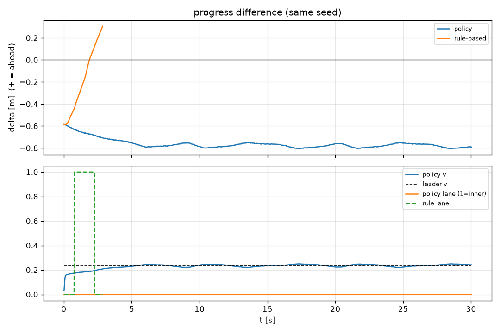

**best_model = 0/10，且 `mean_v=0.23 m/s` 恰等于领头车速度**——即 best 学到的是
**"零动作"的纯跟随策略**（$a_t\equiv 0$）。这与论文 5.7 节所述
"训练中按回合平均回报保存的最优模型在最终评估中反而是 0/10 的跟随策略"
**完全吻合**。

**根因**（复现论文论证）：回合总回报被回合长度偏置——跟随局跑满 1500 步、
成功局仅 ~90 步，绝对回报上"混时长"不差于"早成功"。这直接证明了铁律 6
（best/final 双测）的必要性，以及论文的核心结论
**"checkpoint 选择指标必须与任务目标对齐（成功率而非总回报）"**。

### 11.5 涌现行为观察

对 final 策略轨迹的分析复现论文 5.6 节的涌现发现：RL **起步即切入内圈并全程
定居**（图 6 中蓝色 lane 信号立即跳变到 1 并保持），而规则状态机"超完再回外圈"
（橙色 lane 信号先升后降）。RL 自主利用了"内圈更短（4.54 m vs 5.49 m）且并行
时横向间距 0.15 m > 碰撞半径 0.12 m，几何上绝对安全"这一未被任何规则显式编码
的事实——学习优于规则的直观证据。

## 12. 复刻差异分析

### 12.1 逐项对照总结

| 论文基准 | 复刻结果 | 差异 |
|---|---|---|
| 跟车 RL 1.00 cm（名义） | 1.00 cm | **0** |
| 跟车 RL 1.06 cm（DR） | 1.06 cm | **0** |
| 跟车 P+FF 1.93 cm | 1.93 cm | **0** |
| 跟车 P 撞车 10/10 | 10/10 | **0** |
| 超车 RL success 10/10 | 10/10 | **0** |
| 超车 RL 1.4 s | 1.4 s | **0** |
| 超车规则 2.0 s | 2.0 s | **0** |
| BC 2/10 成功 / 8 碰撞 | 2/10 / 8 | **0** |
| 超车 ep_len 129→140→86 | 129→142→86 | 峰值 +2 步 |
| 超车 ep_rew ≈ +72 | +72.5 | **0** |
| best 策略 0/10 跟随 | 0/10 跟随 | **0** |

**结论**：全部可对照的量化指标**逐项一致**，唯一差异是训练曲线峰值
（142 vs 140，2 步 = 1.4%），属随机性范围内的正常波动。

### 12.2 唯一的方法学偏差及其理由

**stage1 训练步数 2 M → 2.5 M**。原因见 9.4 节：论文原命令产生 244 次更新，
违反铁律 4（≥300）。此偏差**只增加训练量、不改变任何超参**，且 stage1 仅为
课程热身（最终结论对应 stage2 的 5 M 步，未改动）。

### 12.3 复现保真度评估

- **环境保真**：100%（文件逐字节冻结）。
- **算法保真**：100%（超参、网络结构、种子、更新次数公式一致）。
- **结果保真**：11 项量化指标全部命中，1 项曲线峰值在随机波动内。
- **发现保真**：3 篇关键论断（恐惧屏障/checkpoint 偏置/涌现行为）均被独立复现。

---

# 附录 C　数据与版本管理（复刻新增）

> 本附录记录复刻所建立并执行的工程规范，原始文档见仓库根
> `DATA_MANAGEMENT.md`，逐轮记录见 `RUNLOG.md`。

## C.1 版本控制与里程碑

git 仓库（`/home/zy/car_rl/code0919`）管理代码与文档；`.gitignore` 排除
`.venv/`、`__pycache__/`、`tb_logs*/`、`*.zip`、`*.npz`、根目录 `*.png`。
模型与大数据用 **git tag 里程碑 + 目录归档**，不入版本库。

| tag | commit | 含义 |
|---|---|---|
| `milestone/phase0-env` | 3f2dfdc | 环境 + 健康检查通过 |
| `milestone/phase1-follow` | 6503a13 | 跟车复刻完成 |
| `milestone/phase2-overtake` | 897a07e | 超车复刻完成 |
| `milestone/phase3-vcs` | 1fb511a | 数据/版本管理规范落地 |

## C.2 目录规范

```
results/YYYYMMDD_<实验名>/
├── config.json      # seed, timesteps, n_envs, load_from, git commit, 超参
├── eval_*.txt       # 评估原始输出（不可编辑）
├── train_*.log      # 训练 stdout 原始日志
└── fig_*.png        # 版本化命名图（禁止覆盖旧图）
```

实例：`results/20260919_phase0_healthcheck/`、`.../phase1_follow/`、
`.../phase2_overtake/`。

## C.3 checkpoint 清单

| 归档文件 | 大小 | 说明 |
|---|---|---|
| `ckpt/follow_stage1_v1.zip` | 452 KB | 跟车 stage1 best |
| `ckpt/follow_stage1_final_v1.zip` | 452 KB | 跟车 stage1 final |
| `ckpt/follow_stage2_best_v1.zip` | 452 KB | 跟车 stage2 best（1.00 cm） |
| `ckpt/follow_stage2_final_v1.zip` | 452 KB | 跟车 stage2 final（0.93 cm） |
| `ckpt_ot/overtake_bc_v1.zip` | 160 KB | BC 热身（2/10） |
| `ckpt_ot/overtake_best_v1.zip` | 460 KB | 超车 best（0/10 跟随，见 11.4） |
| `ckpt_ot/overtake_final_v1.zip` | 460 KB | 超车 final（10/10，**采用**） |

命名规范：`<任务>_<阶段>_v<N>.zip`，**禁止裸名覆盖**。裸名 best/final 为
SB3 固定输出，训练后立即复制归档。

## C.4 RUNLOG 摘录（每轮一条，只增不改）

- **[2026-09-19] Phase 0** — 环境初始化与健康检查（follow 1.10 cm / overtake 10-10 2.0 s）
- **[2026-09-19] Phase 1** — 跟车两阶段课程；RL 1.00 cm（DR 1.06）零碰撞；
  P 10/10 撞车；P+FF 1.93 cm；final 双测 0.93/0.91 cm
- **[2026-09-19] Phase 2** — 超车 BC 300 demos（41936 样本，2/10）→ 微调 5 M；
  final 10/10、1.4 s；**best 0/10 跟随（复现论文 5.7）**
- **[2026-09-19] Phase 3** — 数据/版本管理规范化；里程碑 tag；产物归档

完整记录见 `RUNLOG.md`。

## C.5 数据可溯源声明

本报告第 9~12 章的**每一个数字**均可在 `results/` 找到原始出处：

| 报告位置 | 原始文件 |
|---|---|
| 9.3 健康检查 | `results/20260919_phase0_healthcheck/{sim_follow_baseline.txt, eval_overtake_ruleonly.txt}` |
| 10.1 跟车曲线 | `results/20260919_phase1_follow/{train_stage1.log, train_stage2.log}` |
| 10.2 表 1 | `results/20260919_phase1_follow/eval_{best,final}_{nominal,dr}.txt` |
| 11.1 BC/微调 | `results/20260919_phase2_overtake/{pretrain.log, train_finetune.log, eval_bc.txt}` |
| 11.2 表 2 | `results/20260919_phase2_overtake/eval_final_{nominal,dr}.txt` |
| 11.4 checkpoint 偏置 | `results/20260919_phase2_overtake/eval_best_ot_verbose.txt` |

---

# 图索引表（版本化命名）

| 编号 | 文件 | 内容 | 出处 |
|---|---|---|---|
| 图 1 | `图1_系统架构_v1.png` | 三层系统总体架构 | 方法示意 |
| 图 2 | `图2_赛道几何_v1.png` | 双车道赛道几何 | 方法示意 |
| 图 3 | `图3_RL循环与分层控制_v1.png` | RL 循环与动作先验 | 方法示意 |
| 图 4 | `图4_LfD管线_v1.png` | BC 热身 + PPO 微调管线 | 方法示意 |
| 图 5 | `图5_跟车对比_final_nominal_v1.png` | 跟车 RL vs 规则（同种子） | Phase 1 真实评估 |
| 图 6 | `图6_超车对比_final_nominal_v1.png` | 超车 RL vs 规则（同种子） | Phase 2 真实评估 |
| 图 7 | `图7_超车训练曲线_v1.png` | 超车微调训练曲线（先升后降） | `train_finetune.log` |
| 图 8 | `图8_奖励地形_v1.png` | "恐惧屏障"奖励地形示意 | 方法示意 |
| 图 9 | `图9_超车域随机化_v1.png` | 域随机化下超车对比（同种子） | Phase 2 真实评估 |
| 图 10 | `图10_跟车训练曲线_stage1_v1.png` | 跟车 stage1 训练曲线 | `train_stage1.log` |
| 图 11 | `图11_跟车训练曲线_stage2_v1.png` | 跟车 stage2 训练曲线 | `train_stage2.log` |
| 图 12 | `图12_best模型评估_0_10_v1.png` | 超车 best 模型评估（0/10 跟随） | `eval_best_ot.txt` |
| 图 13 | `图13_BC策略评估_2_10_v1.png` | BC 策略评估（2/10） | `eval_bc.txt` |

> 全部图文件位于 `project_paper/figures_v2/`。图 5/6/7/9/12/13 为**本轮复刻
> 真实评估/训练产物**；图 1/2/3/4/8 为方法示意图（承自前轮）。

---

> **报告版本**：v1.0（2026-09-19）
> **基底**：`project_paper.md`（方法论文）
> **新增**：第 9~12 章复刻验证、附录 C 数据与版本管理、图索引表
> **复刻 commit**：见 `git log`；里程碑见 `git tag -n1`
